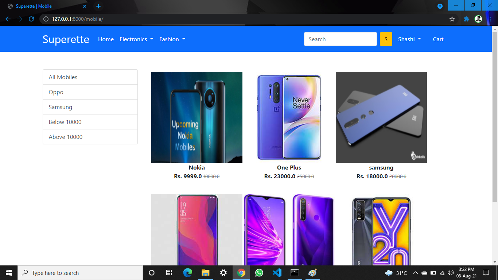
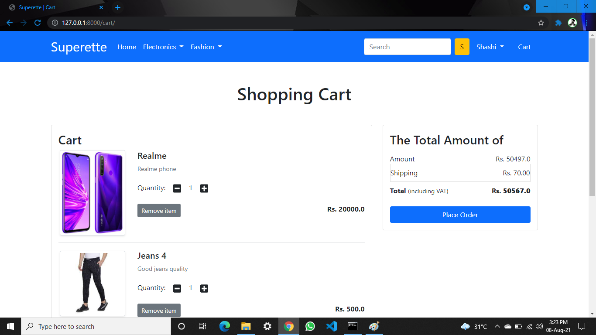
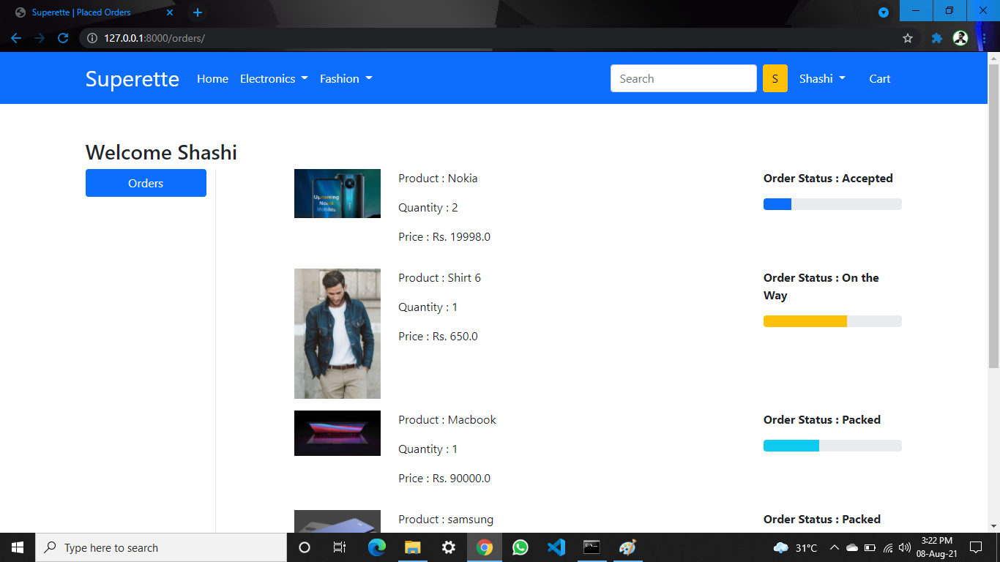

# Superette
Superette || Django || Python || MySQL (Shopping Website)

 ======== ***Problem Statement:*** ===========  
 
 This projects aims to develop an online shopping for customers with the goal so that it is very easy to shop your loved things from a extensive number of online shopping sites available on the web. 
With the help of this you can carry out an online shopping from your home. 
Here is no compelling reason to go to the crowed stores or shopping centers during festival seasons. You simply require a PC or a laptop and one important payment sending option to shop online.
To get to this online shopping system all the customers will need to have a email and password to login and proceed your shopping.
The login credentials for an online shopping system are under high security and nobody will have the capacity to crack it easily. 

======== ***Language Used:*** ===========  

Tools required for project development:-
 
Python ( 3.7 version) 
HTML 
CSS 
Javascript 
JQuery 
AJAX 
Bootstrap 
Django 
MySql 
 

 ======== ***Home Page (After Logged In):*** ===========  
After logging In, user will have proper access to all the stuffs avaliable on the web page like shopping shopping Mobiles, Laptops, bottom wae, top wear, adding to cart and placing the Orders etc.

 ======== ***Filters:*** ===========  
 
 Also can Filter for Each and Every Product and also with Prices
 
 
 
 
 
  ======== ***Product Details:*** ===========  
 
 Can order the Products avail on offer with particular Bank
 
 
 
 
   ======== ***Cart:*** ===========  
 
You can have multiple Products in the Cart and also multiple same product, where this page Calculates overall price of all the products as you can see in the Cart page image down below
 
 
 
  
   ======== ***Track the Orders:*** ===========  
 
You will also have the access to track the orders where you can see weather your Product is **Accepted** or **On the Way** or **Packed**.
 
 
 
 
   
 
***Thank you.....***
 
 
